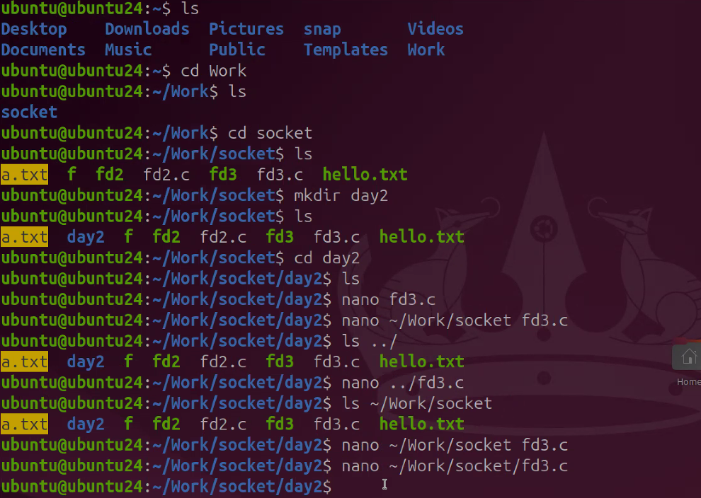
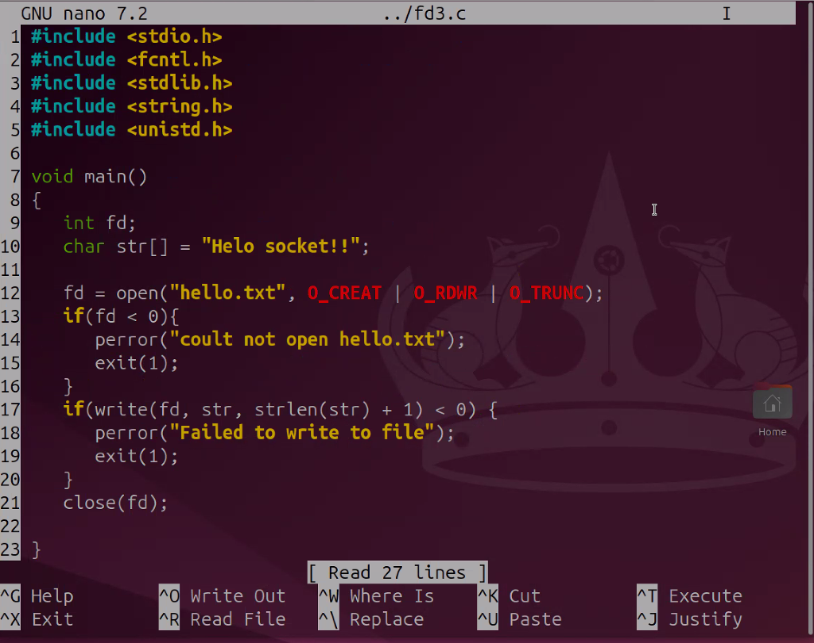

fd3.c


절대경로

상대경로

## 프로토콜의 이해와 소켓의 생성

### 프로토콜이란?
- 개념적으로 약송의 의미
- 컴퓨터 상호간의 데이터 송수신에 필요하 통신규약
- 소켓을 생성할 때 기본적인 프로토콜을 지정

```c
#include<sys/socket.h>

int socket(int domain, int type, int protocol);
```
- domain : 소켓이 사용할 프로토콜 체계 정보 전달
- type : 소켓의 데이터 전송방식에 대한 정보 전달
- protocol : 두 컴퓨터간 통신에 사용되는 프로토콜 정보 전달

- PF_INET : 현재 사용하는 프로토콜 체계