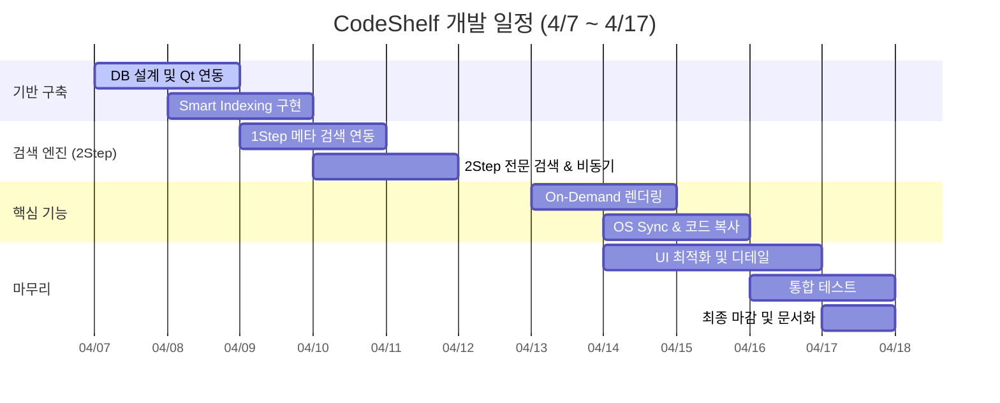
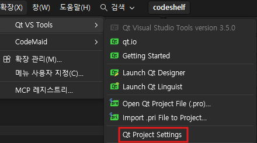

# iot-miniproject1-2026
IoT 개발자과정 미니 프로젝트1

## 04/07

### 미니 프로젝트 제안서

1. 프로젝트 개요
- 프로젝트명 : CodeShelf(코드 큐레이션)
- 기간 : 2026.04.03 ~ 2026.04.16
- 목적 : 여러 프로젝트와 프로젝트 문서 등을 한곳에 모으고 태그 기반으로 분류하여 필요할 때 바로 꺼내 쓸 수 있는 나만의 코드 선반을 구축하는 것

2. 개발 배경
1) 현재 문제상황
- 파편화된 개발 자산의 관리 부재
    - 학습이나 프로젝트 과정에서 수많은 소스를 내려받고 작성하지만, 시간이 지날수록 어떤프로젝트에 어디에 있는지를 기억하지 못해 재사용성이 매우 떨어짐
2) 기존 방식의 한계
- 코드 탐색의 복잡성(OS파일 탐색기의 한계)
    - 윈도우 탐색기나 기본 파일 관리자는 파일명 위주의 검색만 지원, 특정 함수나 로직을 직관적으로 필터링하여 보여주는것은 불가
- IDE 전체 검색의 한계
    - 특정 프로젝트를 열어야만 검색 가능, 수십개의 프로젝트 전체를 대상으로 검색하여 활용하기에는 무리가 있음
3) 개발 필요성
    - 이러한 한계 극복을 위해, 로컬 파일 시스템과 MySQL 인덱싱을 결합하여 검색 기능성과 재사용성을 동시에 잡은 코드 전용 큐레이션인 CodeSelf를 제안함

3. 핵심 기능
- 기능 1: 지능형 코드 인덱싱 및 등록(Smart Indexing)
    - 로컬 폴더 동기화, 메타데이터 추출, 사용자 정의 태깅
- 기능 2: 2Step 통합 검색 엔진
    - 메타 검색(MySQL인덱스), 코드 전문 검색, 개발언어별 필터링
- 기능 3: 실시간 코드 프리뷰 및 큐레이션
    - On-Demand 렌더링(실시간 코드 불러오기), 구문강조(언어별 하이라이팅), 즉각적 재사용(코드복사 및 파일탐색기 실행)

4. 기술 스택
1) Frontend: 
- Framework: Qt Widget(C++기반)
- KeyClass: 
    - `QMainWindow`: 메인 창 구조 설계
    - `QTreeView` / `QListView`: 로컬 폴더 구조 및 검색 결과 리스트 표시
    - `QTextEdit` / `QSyntaxHighlighter`: 코드 프리뷰 및 언어별 구문 강조 기능
2) Backend:
- Language: C++ 17/20
- Key Module: 
    - File System: `QDirIterator`, `QFile`, `QFileInfo를` 활용한 초고속 로컬 디렉토리 재귀 스캔.

    - Search Engine: `QString::contains()` 및 정규표현식(`QRegularExpression`)을 이용한 1차 필터링.

    - OS Sync: `QProcess를` 활용하여 `explorer.exe /select, [path]` 명령 실행 (탐색기 연동).
- Thread: `QThread` 또는 `QtConcurrent를` 사용하여 파일 스캔 시 UI가 멈추지 않도록 비동기 처리
3) Database:
- DB Engine: MySQL 8.0
- Connector: `Qt SQL Module (QsqlDatabase)`

5. 기대 효과
1) 사용자 측면: 
    - 탐색시간의 단축
        - 윈도우 탐색기나 무거운 IDE를 일일이 뒤질필요X
        - 2Step 검색 엔진으로 원하는 코드 위치를 빠르게 찾아냄
    - 직관적인 코드 큐레이션
        - 파일을 열지 않고도 필요한 부분만 선택하여 빠르게 복사 및 재사용 가능
    - 개인 지식 자산화
    
2) 기술적 성과:
    - 효율적인 데이터 구조 설계
        - MySQL 인덱스를 활용한 DB연동 로직
    - 멀티스레딩을 통한 UI 반응성 확보
        - 파일스캔이나 전문 검색 등 오래걸리는 작업이 돌아갈 때도 화면이 멈추지 않도록 QtConcurrent를 활용해 비동기 처리를 매끄럽게 구현
    - 정규표현식 기반의 정밀 탐색
3) 활용 가능성: 
- 개인용 지식 베이스 구축
- 팀 단위 코드 공유 및 온보딩 툴
    - 로컬 DB를 클라우드 서버로 전환하여 협업 지원도구로 발전 가능
- AI 기반 자동 추천 엔진 연동

6. 개발 일정



7. 역할 분담
8. 리스크 및 대응
1) 성능저하(대용량 스캔)
    - 리스크: 수만개의 파일 인덱싱 시 UI 멈춤 및 검색속도 저하
    - 대응: QtConcurrent 비동기 처리 및 DB인덱스 최적화
2) 경로 단절(폴더 이동)
    - 리스크: 사용자가 프로젝트 폴더 위치를 옮기면 기존 연결이 깨짐
    - 대응 : 루트(절대경로) + 하위(상대경로)로 분리 저장 및 경로 재연결 기능 추가

## 04/08

### 데이터베이스 설계
1. 

2. 

3. 

DB 연결 실패 사유: "Driver not loaded Driver not loaded" 일 경우 해결방안

1. 사전 준비
Qt Maintenance Tool을 통해 아래 구성 요소가 설치되어 있는지 확인
- Qt 6.11.0 하위의 `Sources`
- Build Tools 하위의 `CMake` 및 `Ninja`
- MySQL Server 8.0 설치 (C:\Program Files\MySQL\MySQL Server 8.0)

2. 드라이버 빌드 절차
- 단계 1: 전용 터미널 실행
    - `Everything`을 실행하여 `x64 Native Tools Command Prompt for VS 2022`를 찾아 실행 
- 단계 2: 환경 변수 및 소스 경로 이동
    ```bash
    # 1. 빌드 도구 경로 설정
    set PATH=C:\Qt\Tools\CMake_64\bin;C:\Qt\Tools\Ninja;C:\Qt\6.11.0\msvc2022_64\bin;%PATH%

    # 2. SQL 드라이버 소스 폴더로 이동
    cd C:\Qt\6.11.0\Src\qtbase\src\plugins\sqldrivers
    ```
- 단계 3: CMake 구성
    - 꼬인 설정 초기화 및 MySQL 드라이버 활성화
    -` -DFEATURE_sql_sqlite=OFF`: 기존 설치된 SQLite와의 타겟 충돌 방지
    ```bash
    # 기존 캐시 삭제 (필요 시)
    del /f /q CMakeCache.txt
    rd /s /q CMakeFiles

    # MySQL 전용 빌드 구성
    qt-cmake -G Ninja . ^
    -DMySQL_INCLUDE_DIR="C:\Program Files\MySQL\MySQL Server 8.0\include" ^
    -DMySQL_LIBRARY="C:\Program Files\MySQL\MySQL Server 8.0\lib\libmysql.lib" ^
    -DFEATURE_sql_mysql=ON ^
    -DFEATURE_sql_sqlite=OFF ^
    -DFEATURE_sql_odbc=OFF
    ```
- 단계 4: 빌드 및 설치
    ```bash
    # 빌드 시작
    cmake --build .

    # 설치 (plugins/sqldrivers 폴더로 자동 복사)
    cmake --install .
    ```
3. 런타임 라이브러리 연동
- 1: 원본 파일 복사
    - `C:\Program Files\MySQL\MySQL Server 8.0\lib\libmysql.lib` (또는 `.dll`)
- 2: 대상 폴더에 붙여넣기
    - `C:\Qt\6.11.0\msvc2022_64\bin`
    - 프로젝트의 실행 파일(`.exe`)이 생성되는 폴더 (`x64/Debug`)


4. 결과 확인
    ```C++
    QSqlDatabase db = QSqlDatabase::addDatabase("QMYSQL");
    qDebug() << "Available Drivers:" << QSqlDatabase::drivers();

    if (db.open()) {
        qDebug() << "MySQL 연결 성공!";
    } else {
        qDebug() << "연결 실패 사유:" << db.lastError().text();
    }
    ```

- 보통 오류나면 높은 확률로 dll 불일치 인듯
- 디버그 그냥 안되니깐 릴리즈로 해

### 함수 정리 (04/09)

#### void scanDirectory(const Qstring& path)
- 예는 기본적으로 파일을 스캔하고 트리를 업뎃해주는데
- 현재는 DB에 등록하고 ID를 확보하는 것도 추가해져있음
1. 먼저 currentRootPath에 경로를 저장하고
2. QSqlQuery를 이용해 DB를 등록한다
- 여기서 쓰이는 구문은
    ```sql
    INSERT INTO storage_roots (root_path, past_scanned) 
    VALUES (:path, NOW())
        ON DUPLICATE KEY UPDATE past_scanned = NOW(), id = LAST_INSERT_ID(id)
    ```
- 이렇게 구현되어있고, 기본적으로 없으면 등록하고 있으면 날짜만 업데이트 시키는 로직이다
3. 쿼리를 실행해서 성공했을경우엔 currentRootId에 마지막으로 처리된 row의 id를 가져와서 int로 변환시켜준다
4. 트리를 초기화하고, 루트 노드를 생성해 준다
- QFileInfo rootInfo(path)로 경로의 정보를 가져오고
- rootInfo.fileName()을 이용하여 폴더의이름만 추출한다(`C:/text` -> `test`)
- QTreeWidgetItem(categoryTree)를 이용해서 트리의 최상위(root) 노드를 생성해주고
- setIcon()아이콘 설정해주고, setExpanded(true)를 사용해 펼쳐준다
> 트리의 시작점을 생성해줌

5. 그다음엔 트랜잭션 관리도 여기서 해주는데 폴더 탐색 전에 묶음 처리할꺼라고 표시를 해줌
- 그게 바로 `QSqlDatabase::database().transaction();` 인것 이건 시작을 뜻하는거고
- transaction대신 `commit`을 넣어주면 끝을 의미함. 지금까지의 작업을 한번에 저장하는거지
- 이렇게 해야 안전하고 빠름


## 전체적 정리

### 1. 초기화 및 UI 구성

### 2. 파일 시스템 & DB 동기화

### 3. 사용자 상호작용


QHash 를 사용해서 dbfile맵을 만듦

태그기능은 처음 폴더 등록시랑 변경된 파일일때만 수행하도록 로직을 짜기

태그 추출

Qt의 플로우 레이아웃 예제
https://doc.qt.io/qt-6/qtwidgets-layouts-flowlayout-example.html

## 사용한 sql 구문

### 파일 스캔 및 트리 업데이트(scanDirectory)
```sql
-- 해당 경로가 있는지 확인 후 ID 가져오기
SELECT id FROM storage_roots WHERE root_path = :path
-- 이미 있는 경로면 시간 업데이트
UPDATE storage_roots SET past_scanned = NOW() WHERE id = :id
-- 처음 등록 하는 경로면 INSERT
INSERT INTO storage_roots (root_path, past_scanned)
VALUES (:path, NOW())
```
- `:path` - path
- `:id` - currentRootId

- QHash<QString, QDateTime> dbFileMap;
- 해당 파일이 언제 수정됐는지 빠르게 찾기위한 해쉬
```sql
SELECT rel_path, last_modified FROM codes WHERE root_id = :rid
```
- codes 테이블에서 rel_path, last_modified를 가져옴

### 파일 내용을 읽어서 넣기(insertFileRecord)
```sql
INSERT INTO codes(root_id, rel_path, file_name, extension, file_size, content, last_modified
VALUES (:root_id, :rel_path, :name, :ext, :size, :content, :modified)
ON DUPLICATE KEY UPDATE -- 중복 로직
file_size = :size, content = :content, last_modified = :modified
```
- :root_id - currentRootId
- :rel_path - relPath
- :name - info.fileName()
- :ext - info.suffix().toLower()
- :size - info.size()
- :content - fileContent
- :modified - info.lastModified().toString("yyyy-MM-dd HH:mm:ss")

### 칩생성(loadTagsFromDb)
```sql
-- DB연결 재확인 및 쿼리 실행
SELECT DISTINCT upper(extension) FROM codes WHERE root_id = :rid;
```

### 해당 확장자를 가진 데이터 셀렉트
```sql
SELECT file_name, last_modified, tags FROM codes 
 WHERE root_id = :rid AND upper(extension) = :ext
 ORDER BY last_modified DESC 
 LIMIT :limit OFFSET :offset
```
`:rid` - currentRootId
`:ext` - ext.toUpper()
`:limit` - pageSize
`:offset` - offset

### updatePagination
해당 확장자의 전체 아이템 개수 가져오기
```sql
SELECT COUNT(*) FROM codes WHERE root_id = :rid
-- !ext.isEmpty()
AND UPPER(extension) = UPPER(:ext)
-- !keyword.isEmpty()
AND UPPER(file_name) LIKE UPPER(:keyword)
```
if (!ext.isEmpty()) {
    query.bindValue(":ext", ext.toUpper());
}

if (!keyword.isEmpty()) {
    query.bindValue(":keyword", "%" + keyword + "%");
}

### filterBySearch
```sql
SELECT file_name, rel_path, extension FROM codes
WHERE root_id = :rid 
-- !ext.isEmpty()
  AND UPPER(extension) = UPPER(:ext)
-- !keyword.trimmed().isEmpty()
  AND UPPER(file_name) LIKE UPPER(:keyword)

LIMIT :limit OFFSET :offset 
```
if (!ext.isEmpty()) {
    q.bindValue(":ext", ext.toUpper());
}

if (!keyword.trimmed().isEmpty()) {
    q.bindValue(":keyword", "%" + keyword + "%");
}

