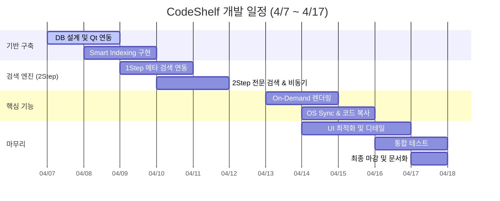

# iot-miniproject1-2026
IoT 개발자과정 미니 프로젝트1

## 04/07

### 미니 프로젝트 제안서

1. 프로젝트 개요
- 프로젝트명 : CodeShelf(코드 큐레이션)
- 기간 : 2026.04.03 ~ 2026.04.16
- 목적 : 여러 프로젝트와 프로젝트 문서 등을 한곳에 모으고 태그 기반으로 분류하여 필요할 때 바로 꺼내 쓸 수 있는 나만의 코드 선반을 구축하는 것

2. 개발 배경
1) 현재 문제상황
- 파편화된 개발 자산의 관리 부재
    - 학습이나 프로젝트 과정에서 수많은 소스를 내려받고 작성하지만, 시간이 지날수록 어떤프로젝트에 어디에 있는지를 기억하지 못해 재사용성이 매우 떨어짐
2) 기존 방식의 한계
- 코드 탐색의 복잡성(OS파일 탐색기의 한계)
    - 윈도우 탐색기나 기본 파일 관리자는 파일명 위주의 검색만 지원, 특정 함수나 로직을 직관적으로 필터링하여 보여주는것은 불가
- IDE 전체 검색의 한계
    - 특정 프로젝트를 열어야만 검색 가능, 수십개의 프로젝트 전체를 대상으로 검색하여 활용하기에는 무리가 있음
3) 개발 필요성
    - 이러한 한계 극복을 위해, 로컬 파일 시스템과 MySQL 인덱싱을 결합하여 검색 기능성과 재사용성을 동시에 잡은 코드 전용 큐레이션인 CodeSelf를 제안함

3. 핵심 기능
- 기능 1: 지능형 코드 인덱싱 및 등록(Smart Indexing)
    - 로컬 폴더 동기화, 메타데이터 추출, 사용자 정의 태깅
- 기능 2: 2Step 통합 검색 엔진
    - 메타 검색(MySQL인덱스), 코드 전문 검색, 개발언어별 필터링
- 기능 3: 실시간 코드 프리뷰 및 큐레이션
    - On-Demand 렌더링(실시간 코드 불러오기), 구문강조(언어별 하이라이팅), 즉각적 재사용(코드복사 및 파일탐색기 실행)

4. 기술 스택
1) Frontend: 
- Framework: Qt Widget(C++기반)
- KeyClass: 
    - `QMainWindow`: 메인 창 구조 설계
    - `QTreeView` / `QListView`: 로컬 폴더 구조 및 검색 결과 리스트 표시
    - `QTextEdit` / `QSyntaxHighlighter`: 코드 프리뷰 및 언어별 구문 강조 기능
2) Backend:
- Language: C++ 17/20
- Key Module: 
    - File System: `QDirIterator`, `QFile`, `QFileInfo를` 활용한 초고속 로컬 디렉토리 재귀 스캔.

    - Search Engine: `QString::contains()` 및 정규표현식(`QRegularExpression`)을 이용한 1차 필터링.

    - OS Sync: `QProcess를` 활용하여 `explorer.exe /select, [path]` 명령 실행 (탐색기 연동).
- Thread: `QThread` 또는 `QtConcurrent를` 사용하여 파일 스캔 시 UI가 멈추지 않도록 비동기 처리
3) Database:
- DB Engine: MySQL 8.0
- Connector: `Qt SQL Module (QsqlDatabase)`

5. 기대 효과
1) 사용자 측면: 
    - 탐색시간의 단축
        - 윈도우 탐색기나 무거운 IDE를 일일이 뒤질필요X
        - 2Step 검색 엔진으로 원하는 코드 위치를 빠르게 찾아냄
    - 직관적인 코드 큐레이션
        - 파일을 열지 않고도 필요한 부분만 선택하여 빠르게 복사 및 재사용 가능
    - 개인 지식 자산화
    
2) 기술적 성과:
    - 효율적인 데이터 구조 설계
        - MySQL 인덱스를 활용한 DB연동 로직
    - 멀티스레딩을 통한 UI 반응성 확보
        - 파일스캔이나 전문 검색 등 오래걸리는 작업이 돌아갈 때도 화면이 멈추지 않도록 QtConcurrent를 활용해 비동기 처리를 매끄럽게 구현
    - 정규표현식 기반의 정밀 탐색
3) 활용 가능성: 
- 개인용 지식 베이스 구축
- 팀 단위 코드 공유 및 온보딩 툴
    - 로컬 DB를 클라우드 서버로 전환하여 협업 지원도구로 발전 가능
- AI 기반 자동 추천 엔진 연동

6. 개발 일정

7. 역할 분담
8. 리스크 및 대응
1) 성능저하(대용량 스캔)
    - 리스크: 수만개의 파일 인덱싱 시 UI 멈춤 및 검색속도 저하
    - 대응: QtConcurrent 비동기 처리 및 DB인덱스 최적화
2) 경로 단절(폴더 이동)
    - 리스크: 사용자가 프로젝트 폴더 위치를 옮기면 기존 연결이 깨짐
    - 대응 : 루트(절대경로) + 하위(상대경로)로 분리 저장 및 경로 재연결 기능 추가

### 데이터베이스 설계
1. 

2. 

3. 

