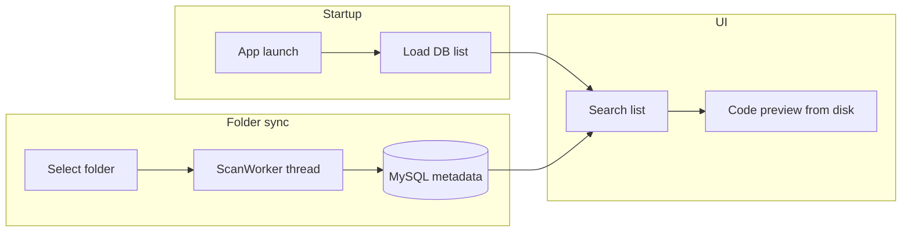

# CodeShelf

**로컬 소스 코드를 DB에 색인하고 검색·미리보기하는 Qt 데스크톱 앱**

IoT 소프트웨어 과정 미니프로젝트 · C++ / Qt 6 / MySQL

[](https://www.qt.io/)
[](https://www.mysql.com/)
[](https://github.com/)

> 로컬 프로젝트 폴더의 C/C++/Python/SQL 파일을 수집·저장·조회하는 **엣지형 데이터 관리 도구**  
> Acquisition → Storage → Query/Visualization 파이프라인을 데스크톱 환경에서 구현했습니다.

<!-- 스크린샷 추가 후 아래 주석 해제

-->

---

## Why this project?

개발 중 자주 찾는 코드 파일을 한 화면에서 검색하고 미리볼 수 있도록 만들었습니다.  
단순 파일 탐색기가 아니라 **메타데이터 DB + 검색 UI + 백그라운드 동기화**까지 포함한 End-to-End 구조입니다.

### Highlights

- **빠른 시작**: 앱 실행 시 DB 캐시만 로드 (디스크 전체 스캔 없음)
- **백그라운드 스캔**: `QThread` + `ScanWorker`로 UI 블로킹 방지
- **증분 동기화**: 경로 정규화 + 수정 시각 비교로 변경 파일만 DB 반영
- **페이지네이션**: DB `LIMIT/OFFSET` 기반 목록 조회
- **코드 미리보기**: `QSyntaxHighlighter` 기반 다중 언어 하이라이팅

---

## Demo

| 기능 | 설명 |
|------|------|
| 검색·필터 | 확장자 태그, 제목/내용 검색 모드, 페이지 이동 |
| 미리보기 | 파일 클릭 시 디스크에서 읽어 코드 표시 |
| 동기화 | 「폴더 선택」으로 디스크 ↔ DB 메타데이터 동기화 |
| 세션 복원 | 마지막 작업 폴더 `QSettings` 저장 |

<!-- GIF 추가 시

-->

---

## Architecture



자세한 설명: [docs/architecture.md](docs/architecture.md)

---

## Tech stack

| Category | Tools |
|----------|-------|
| Language | C++ |
| UI | Qt 6 Widgets (`QSplitter`, `QStackedWidget`, custom layout) |
| Database | MySQL (`QMYSQL`, prepared statements) |
| Build | Visual Studio 2022, Qt VS Tools |
| OS | Windows x64 |

---

## Project structure

```text
codeshelf/
├── codeshelf/           # Application source
│   ├── codeshelf.cpp/h  # Main window & UI logic
│   ├── DatabaseManager  # MySQL access layer
│   ├── ScanWorker       # Background scan worker
│   └── CodeHighlighter  # Syntax highlighting
├── sql/                 # DB bootstrap scripts
├── docs/                # Architecture & screenshots
├── codeshelf.slnx       # Visual Studio solution
└── README.md
```

---

## Getting started

### Prerequisites

- Windows 10/11 x64
- Visual Studio 2022 + Desktop development with C++
- Qt 6.x (MSVC 2022 64-bit) + Qt VS Tools
- MySQL Server 8.x + MySQL client libraries for Qt

### 1. Database setup

```bash
mysql -u root -p < sql/database_create.sql
mysql -u root -p < sql/Table_create.sql
```

`DatabaseManager::connectDB()`의 host / user / password / dbName를 로컬 환경에 맞게 수정하세요.  
**운영·공개 저장소에는 비밀번호를 커밋하지 않는 것을 권장합니다.**

### 2. Build

1. `codeshelf.slnx` 를 Visual Studio에서 엽니다.
2. 구성: **Release | x64**
3. 빌드 후 `codeshelf/x64/Release/codeshelf.exe` 실행

### 3. Usage

1. **실행** — 이전에 저장된 폴더의 DB 목록이 표시됩니다.
2. **폴더 선택** — 디스크와 DB를 백그라운드로 동기화합니다.
3. **검색 / 태그** — 확장자·키워드로 파일을 찾습니다.
4. **항목 클릭** — 오른쪽 패널에서 코드를 미리봅니다.

---

## What I learned

- Qt 시그널/슬롯, worker thread, DB connection per thread
- MySQL 스키마 설계와 검색 쿼리 (`LIKE`, `COUNT`, pagination)
- 대용량 폴더 스캔 시 UI 응답성·증분 업데이트 트레이드오프
- 프로토타입 → 성능 개선(시작 경로, 백그라운드 스캔, 메타만 저장) iteration

---

## Known limitations

- 「제목 + 내용」 DB 검색: 스캔 시 `content` 미저장 정책으로 FULLTEXT 활용이 제한됨
- 디스크에서 삭제된 파일은 DB에 잔존할 수 있음
- `tags` / `code_tags` 테이블은 스키마에만 존재 (앱 미연동)

변경 이력: [CHANGELOG.md](CHANGELOG.md)

---

## Portfolio blurb (copy-paste)

> **CodeShelf** — C++/Qt6·MySQL 기반 로컬 코드 색인·검색 도구.  
> 파일 메타데이터 수집, 백그라운드 스캔, 증분 동기화, DB 페이지네이션 UI를 구현하며 IoT 데이터 파이프라인(Acquisition → Storage → Query)을 데스크톱 환경에 적용했습니다.

---

## License

[MIT](LICENSE)

---

## Author

IoT Software Mini Project · 2026

GitHub: [@minchochocho](https://github.com/minchochocho)

포트폴리오용 단독 저장소 올리기: [docs/GITHUB_SETUP.md](docs/GITHUB_SETUP.md)
