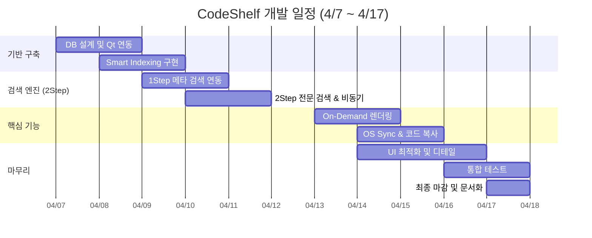

# CodeShelf 개발 노트 (README2)

IoT 개발자과정 미니 프로젝트1 · CodeShelf(코드 큐레이션)  
기간: 2026.04.03 ~ 2026.04.16

---

## 04/07 — 미니 프로젝트 제안서 요약

### 프로젝트 개요

- **프로젝트명**: CodeShelf(코드 큐레이션)
- **목적**: 여러 프로젝트와 문서를 한곳에 모으고 태그 기반으로 분류하여, 필요할 때 바로 꺼내 쓸 수 있는 나만의 코드 선반 구축

### 핵심 기능

1. **지능형 코드 인덱싱 및 등록 (Smart Indexing)** — 로컬 폴더 동기화, 메타데이터 추출, 사용자 정의 태깅
2. **2Step 통합 검색 엔진** — 메타 검색(MySQL 인덱스), 코드 전문 검색, 개발언어별 필터링
3. **실시간 코드 프리뷰 및 큐레이션** — On-Demand 렌더링, 구문 강조, 코드 복사 및 탐색기 연동

### 기술 스택

| 구분 | 기술 |
|------|------|
| Frontend | Qt Widget (C++), QMainWindow, QTreeWidget, QTextEdit, QSyntaxHighlighter |
| Backend | C++ 17/20, QDirIterator, QRegularExpression, QProcess, QThread / QtConcurrent |
| Database | MySQL 8.0, Qt SQL Module (QSqlDatabase) |

---

## 04/08 — 데이터베이스 설계

### DB 연결 실패: "Driver not loaded"

#### 1. 사전 준비

Qt Maintenance Tool에서 아래 구성 요소 설치 확인:

- Qt 6.11.0 하위 `Sources`
- Build Tools 하위 `CMake` 및 `Ninja`
- MySQL Server 8.0 (`C:\Program Files\MySQL\MySQL Server 8.0`)

#### 2. 드라이버 빌드 절차

**단계 1** — `x64 Native Tools Command Prompt for VS 2022` 실행

**단계 2** — 환경 변수 및 소스 경로 이동

```bash
set PATH=C:\Qt\Tools\CMake_64\bin;C:\Qt\Tools\Ninja;C:\Qt\6.11.0\msvc2022_64\bin;%PATH%
cd C:\Qt\6.11.0\Src\qtbase\src\plugins\sqldrivers
```

**단계 3** — CMake 구성

```bash
del /f /q CMakeCache.txt
rd /s /q CMakeFiles

qt-cmake -G Ninja . ^
-DMySQL_INCLUDE_DIR="C:\Program Files\MySQL\MySQL Server 8.0\include" ^
-DMySQL_LIBRARY="C:\Program Files\MySQL\MySQL Server 8.0\lib\libmysql.lib" ^
-DFEATURE_sql_mysql=ON ^
-DFEATURE_sql_sqlite=OFF ^
-DFEATURE_sql_odbc=OFF
```

**단계 4** — 빌드 및 설치

```bash
cmake --build .
cmake --install .
```

#### 3. 런타임 라이브러리 연동

- `libmysql.dll` → `C:\Qt\6.11.0\msvc2022_64\bin`
- 프로젝트 실행 파일 폴더 (`x64/Release` 권장 — Debug는 DLL 불일치 가능)

#### 4. 연결 확인 코드

```cpp
QSqlDatabase db = QSqlDatabase::addDatabase("QMYSQL");
qDebug() << "Available Drivers:" << QSqlDatabase::drivers();

if (db.open()) {
    qDebug() << "MySQL 연결 성공!";
} else {
    qDebug() << "연결 실패 사유:" << db.lastError().text();
}
```

---

### 테이블 설계

#### 1. `storage_roots` — 루트 폴더 등록

```sql
CREATE TABLE storage_roots (
    id INT PRIMARY KEY AUTO_INCREMENT,
    root_path VARCHAR(512) NOT NULL UNIQUE,
    alias VARCHAR(100),
    past_scanned DATETIME
);
```

- `root_path`: 절대경로 (Windows는 소문자로 normalize 후 저장)
- `past_scanned`: 마지막 스캔 시각

#### 2. `codes` — 파일 메타 + (선택) 본문

```sql
CREATE TABLE codes (
    id INT PRIMARY KEY AUTO_INCREMENT,
    root_id INT,
    filepath VARCHAR(512) NOT NULL,
    file_name VARCHAR(255) NOT NULL,
    extension VARCHAR(10),
    file_size BIGINT,
    content LONGTEXT,
    tags VARCHAR(255) DEFAULT '',
    last_modified DATETIME,
    FOREIGN KEY (root_id) REFERENCES storage_roots(id) ON DELETE CASCADE,
    UNIQUE (root_id, filepath)
);
```

- `filepath`: **절대경로** (기존 `rel_path`에서 변경)
- `tags`: 확장자 기반 자동 태그 문자열 (예: `#C #C++ #Source`)
- `content`: 전문 검색용. 스캔 시에는 비워 두고, 필요 시 `insertFileRecord`로 채움

#### 3. `tags` / `code_tags` (스키마만 존재)

```sql
CREATE TABLE tags (
    id INT PRIMARY KEY AUTO_INCREMENT,
    tag_name VARCHAR(32) NOT NULL UNIQUE
);

CREATE TABLE code_tags (
    code_id INT,
    tag_id INT,
    PRIMARY KEY (code_id, tag_id),
    FOREIGN KEY (code_id) REFERENCES codes(id) ON DELETE CASCADE,
    FOREIGN KEY (tag_id) REFERENCES tags(id) ON DELETE CASCADE
);
```

> 현재 앱 코드에서는 **미사용**. 태그는 `codes.tags` 컬럼 + 확장자(`extension`) 기반 UI로 처리.

#### 4. 인덱스

```sql
CREATE INDEX idx_extension ON codes(extension);
CREATE INDEX idx_file_name ON codes(file_name);
ALTER TABLE codes ADD FULLTEXT INDEX ft_index (file_name, content) WITH PARSER ngram;
```

- `title` 검색: `file_name LIKE`
- `all` 검색: `MATCH(file_name, content) AGAINST(... IN NATURAL LANGUAGE MODE)`

---

## 변경·추가 사항 요약 (초기 노트 대비)

| 항목 | 기존 | 현재 |
|------|------|------|
| 경로 컬럼 | `rel_path` (상대경로) | `filepath` (절대경로, `normalizePath`로 통일) |
| DB 접근 | `CodeShelf` 안에서 직접 `QSqlQuery` | `DatabaseManager` 싱글톤으로 분리 |
| 스캔 | 메인 스레드 + `transaction()` | `ScanWorker` + `QThread` 백그라운드 |
| 스캔 시 저장 | `content`까지 INSERT | 변경/신규만 **메타데이터** 저장 (`content`는 빈 문자열) |
| 태그 UI | `FlowLayout` 칩 (예정) | `QListWidget` + 커스텀 row (`#ALL`, `#CPP` 등) |
| 검색 | `filterBySearch`에서 바로 SQL | `filterBySearch` → `renderPage` 2단계 + `SearchState` 캐시 |
| 2Step 검색 | 파일명 LIKE만 | `title` = 파일명 LIKE / `all` = FULLTEXT |
| 시작 시 | (없음) | `QSettings`로 마지막 폴더 복원, **디스크 스캔 없이** DB만 로드 |
| 프리뷰 | (없음) | `showDetail` + `CodeHighlighter` + 디스크에서 On-Demand 읽기 |
| OS 연동 | (없음) | `explorer.exe /select, [path]` |

---

## 아키텍처 분리

### `DatabaseManager` (싱글톤)

- DB 연결, 쿼리, 경로 정규화를 한곳에서 처리
- `instance()`로 어디서든 접근

```cpp
DatabaseManager::instance().connectDB();
DatabaseManager::instance().getOrCreateRootID(path);
```

### `ScanWorker` (백그라운드 스캔)

- `QObject` + `moveToThread(scanThread)` 패턴
- 워커 스레드마다 **별도 DB 연결** (`createThreadConnection`)
- 시그널: `scanProgress`, `scanFinished`, `scanFailed`

---

## 사용한 SQL 구문

### 파일 스캔 및 트리 업데이트 (`scanDirectory` / `getOrCreateRootID`)

```sql
-- 해당 경로가 있는지 확인 후 ID 가져오기
SELECT id FROM storage_roots WHERE root_path = :path

-- 이미 있는 경로면 시간 업데이트
UPDATE storage_roots SET past_scanned = NOW() WHERE id = :id

-- 처음 등록하는 경로면 INSERT
INSERT INTO storage_roots (root_path, past_scanned)
VALUES (:path, NOW())
```

- `:path` — normalize된 절대경로
- `:id` — `currentRootId`

---

### 경로·수정시간 맵 (`getFileModificationMap`)

> 기존 `rel_path` → **`filepath`**

```sql
SELECT filepath, last_modified FROM codes WHERE root_id = :rid
```

- `:rid` — `currentRootId`
- 반환: `QHash<QString, QDateTime> dbFileMap` (스캔 시 변경 여부 판단용)

```cpp
QHash<QString, QDateTime> dbFileMap;
// key   : normalizePath(filepath)  — 절대경로
// value : DB의 last_modified
```

---

### 메타데이터만 저장 — 스캔용 (`insertFileMetadata`)

> 스캔 시 호출. **`content`는 빈 문자열**로 저장.

```sql
INSERT INTO codes(root_id, filepath, file_name, extension, file_size, content, last_modified, tags)
VALUES (:rid, :file_path, :name, :ext, :size, '', :modified, :tags)
ON DUPLICATE KEY UPDATE
    file_size = :size,
    last_modified = :modified,
    tags = :tags,
    file_name = :name
```

| 바인딩 | 값 |
|--------|-----|
| `:rid` | `record.rootId` |
| `:file_path` | `normalizePath(record.filePath)` |
| `:name` | `record.fileName` |
| `:ext` | `record.extension` |
| `:size` | `record.fileSize` |
| `:modified` | `record.lastModified.toString("yyyy-MM-dd HH:mm:ss")` |
| `:tags` | 확장자별 자동 태그 (`c/cpp/h` → `#C #C++ #Source` 등) |

---

### 본문 포함 저장 (`insertFileRecord`)

> 전문 검색(`all` 모드)을 위해 **content까지** 넣을 때 사용 (현재 스캔 경로에서는 미호출).

```sql
INSERT INTO codes(root_id, filepath, file_name, extension, file_size, content, last_modified, tags)
VALUES (:rid, :file_path, :name, :ext, :size, :content, :modified, :tags)
ON DUPLICATE KEY UPDATE
    file_size = :size,
    content = :content,
    last_modified = :modified,
    tags = :tags
```

| 바인딩 | 값 |
|--------|-----|
| `:root_id` / `:rid` | `currentRootId` |
| `:file_path` | `normalizePath(record.filePath)` |
| `:name` | `info.fileName()` |
| `:ext` | `info.suffix().toLower()` |
| `:size` | `info.size()` |
| `:content` | `fileContent` |
| `:modified` | `info.lastModified().toString("yyyy-MM-dd HH:mm:ss")` |

---

### 확장자 목록 (`getExtensionByRootId`) — `loadTagsFromDb`

```sql
SELECT DISTINCT UPPER(extension) FROM codes
WHERE root_id = :rid AND extension != ''
```

- `:rid` — `currentRootId`

---

### 파일 목록 조회 (`fetchFiles`) — `filterBySearch` / `renderPage`

```sql
SELECT id, file_name, extension, filepath, last_modified, tags
FROM codes
WHERE root_id = :rid
-- !extension.isEmpty()
  AND UPPER(extension) = :ext
-- !keyword.isEmpty() && searchMode == "title"
  AND file_name LIKE :keyword
-- !keyword.isEmpty() && searchMode == "all"
  AND MATCH(file_name, content) AGAINST(:keyword IN NATURAL LANGUAGE MODE)
ORDER BY last_modified DESC
LIMIT :limit OFFSET :offset
```

| 바인딩 | 값 |
|--------|-----|
| `:rid` | `opt.rootId` |
| `:ext` | `opt.extension.toUpper()` |
| `:keyword` (title) | `"%" + keyword + "%"` |
| `:keyword` (all) | `keyword.trimmed()` (FULLTEXT) |
| `:limit` | `pageSize` (8) |
| `:offset` | `currentPage * pageSize` |

---

### 개수 조회 (`getFileCount`) — `updatePagination` / 태그 카운트

```sql
SELECT COUNT(*) FROM codes WHERE root_id = :rid
-- !extension.isEmpty()
AND UPPER(extension) = :ext
-- !keyword.isEmpty() && searchMode == "title"
AND UPPER(file_name) LIKE UPPER(:keyword)
-- !keyword.isEmpty() && searchMode == "all"
AND MATCH(file_name, content) AGAINST(:keyword IN NATURAL LANGUAGE MODE)
```

```cpp
if (!ext.isEmpty()) {
    query.bindValue(":ext", ext.toUpper());
}

if (!keyword.isEmpty()) {
    if (searchMode == "all") {
        query.bindValue(":keyword", keyword.trimmed());
    } else {
        query.bindValue(":keyword", "%" + keyword + "%");
    }
}
```

- `loadTagsFromDb` / `allTagBtn`에서는 `searchMode = "name"`, `keyword = ""`로 전체/확장자별 개수만 조회

---

## 함수 정리 (04/09 ~)

### `void scanDirectory(const QString& path)` — 변경됨

> 예전: 메인 스레드에서 재귀 스캔 + transaction  
> 현재: **UI는 트리만 준비하고, 스캔은 Worker에 위임**

1. `isScanRunning`이면 중복 스캔 방지
2. `currentRootPath` 저장, `getOrCreateRootID()`로 ID 확보
3. `getFileModificationMap(currentRootId)`로 `dbFileMap` 로드
4. 트리 초기화 + `"스캔 중..."` placeholder
5. `QThread` + `ScanWorker` 생성, `moveToThread`
6. `scanThread->start()` → Worker의 `scan()` 실행
7. 완료 시 `onScanFinished`에서 태그·목록 갱신

> 트랜잭션은 Worker 스레드 내부에서 처리 (`db.transaction()` → `commit` / `rollback`)

---

### `ScanWorker::scan(...)`

1. `codeshelf_scan_[threadId]` 이름으로 DB 연결
2. `db.transaction()` 시작
3. `scanDirRecursive()` 재귀 탐색
4. 성공 → `commit`, 실패 → `rollback`
5. connection 제거 후 `scanFinished(success, changedCount, skippedCount)` emit

---

### `ScanWorker::scanDirRecursive(...)`

1. `QDir::entryInfoList(Dirs | Files | NoDotAndDotDot)` 순회
2. 폴더면 재귀, 파일이면 확장자 필터: **`c`, `cpp`, `h`, `sql`, `py`만**
3. 25개마다 `scanProgress(processedCount)` emit
4. `upsertFileMetadata()` 호출

---

### `ScanWorker::upsertFileMetadata(...)`

1. `absolutePath = normalizePath(info.absoluteFilePath())`
2. `dbFileMap`에 경로가 있고 `isSameFileTime`이면 → `skippedCount++`, **DB 접근 skip**
3. 아니면 `FileRecord` 구성 (`content = ""`)
4. `insertFileMetadata()` 실행 → `changedCount++`

> 태그/메타는 **처음 등록 + 수정된 파일**에만 수행 (skip 로직)

---

### `DatabaseManager::normalizePath(const QString& path)`

1. `QFileInfo(path).absoluteFilePath()`로 절대경로 변환
2. `QDir::fromNativeSeparators`로 `\` → `/` 통일
3. Windows면 `.toLower()` (경로 비교 일관성)

---

### `DatabaseManager::isSameFileTime(dbTime, fileTime)`

1. 둘 다 valid인지 확인
2. `toSecsSinceEpoch()`가 같으면 **변경 없음** → 스캔 skip

---

### `DatabaseManager::createThreadConnection(connectionName)`

1. 스레드별 고유 connection name으로 `QMYSQL` 추가
2. 워커 스레드에서 DB 접근 시 **메인 스레드 connection과 분리** (Qt SQL 필수)

---

### `void loadSessionFromDb(const QString& path)` — 신규

> 앱 시작 시 **디스크 스캔 없이** DB만으로 UI 복원

1. `currentRootPath`, `currentRootId` 설정
2. 트리 루트 노드 1개 생성 (`UserRole`에 경로 저장)
3. `loadTagsFromDb()` → `filterBySearch("", "", "title")`

---

### `void initApp()` — 신규

1. `QSettings("MinSoft", "CodeShelf")`에서 `lastFolderPath` 읽기
2. 경로 없거나 폴더 없으면 종료
3. `loadSessionFromDb(lastPath)` 호출
4. statusBar: 「폴더 선택」으로 디스크와 동기화 가능 안내

---

### `void onDirSelected(const QString& path)` — 신규

1. `QSettings`에 `lastFolderPath` 저장 (`normalizePath` 적용)

---

### `void loadTagsFromDb()` — 변경됨

1. `tagList->clear()`
2. `allTagBtn()` — `#ALL` + 전체 개수
3. `getExtensionByRootId(currentRootId)`로 확장자 목록
4. 각 확장자마다 `getFileCount()`로 개수 표시
5. `QListWidgetItem` + 커스텀 row (`#EXT` + count)
6. 클릭 시 `currentSelectedExt` 갱신 → `filterBySearch` + `updatePagination`

> Qt FlowLayout 예제 참고: https://doc.qt.io/qt-6/qtwidgets-layouts-flowlayout-example.html  
> (현재 구현은 `QListWidget` 기반)

---

### `void allTagBtn()`

1. `SearchOptions`에 `rootId`, `extension=""`, `keyword=""` 설정
2. `getFileCount(opt)`로 전체 파일 수 조회
3. `#ALL` 태그 row를 `tagList`에 추가

---

### `void filterBySearch(ext, keyword, mode)` — 변경됨

> 예전: SQL 실행 후 바로 UI에 addItem  
> 현재: **검색 상태 저장 + 개수 조회 + renderPage**

1. `currentSearch`에 `rootId`, `extension`, `keyword`, `mode` 저장
2. `currentPage = 0`
3. `SearchOptions` 구성 → `getFileCount(opt)` → `totalResultCount`
4. `renderPage()` 호출

---

### `void renderPage()` — 신규

1. `clearCenterLayout()` — 기존 리스트 아이템 제거 (검색창은 유지)
2. `SearchOptions`에 `limit = pageSize(8)`, `offset = currentPage * pageSize`
3. `fetchFiles(opt)` → `cachedResults`
4. `addItem()`으로 중앙 리스트 렌더
5. `updatePagination()` 호출

---

### `void updatePagination(ext, keyword, mode)` — 변경됨

1. `clearPagination()` — 기존 페이지 버튼 삭제
2. `totalResultCount` 기준으로 `totalPages` 계산
3. 페이지 **그룹** (`pageGroupSize = 6`): `<` `[1][2]...[6]` `>`
4. 버튼 클릭 → `currentPage` 변경 → `renderPage()` (DB 재조회)

---

### `void addItem(...)`

1. 파일명·날짜·확장자 태그가 있는 카드형 `QWidget` 생성
2. `setProperty("fileName")`, `setProperty("fullPath")` — 클릭 시 `showDetail`용
3. `installEventFilter(this)` — 클릭 감지
4. hover 스타일 적용

---

### `bool eventFilter(...)`

1. `MouseButtonRelease` + LeftButton
2. `property("fullPath")` 읽어 `showDetail(name, path)` 호출

---

### `void showDetail(name, path)` — On-Demand 프리뷰

1. `currentFilePath` 저장
2. `lblFileName`, `lblFileDate`, `lblFilePath` 갱신
3. `tagLayout`에 `#확장자` 칩 표시
4. `highlighter->setLanguage(suffix)` — 언어별 규칙 전환
5. **`QFile`로 디스크에서 직접 읽기** (DB content 사용 안 함)
6. `codePreview->setPlainText(...)`

---

### `CodeHighlighter::setLanguage(extension)`

1. `highlightingRules` 초기화
2. 언어별 주석 구분: `/* */` (C/C++/SQL), `"""` (Python)
3. `h/c` → `cpp` 맵 사용
4. 키워드 + 공통 규칙(문자열, 숫자, `#include`, `//`, 함수명) 적용
5. `rehighlight()`

---

### `void onCopyClicked()` / `copyToClipboard(text)`

1. `QApplication::clipboard()->setText(text)`
2. statusBar: "클립보드에 복사되었습니다" (2초)

---

### `void onOpenDirClicked()` — OS Sync

1. `currentFilePath` 유효성 검사
2. `QDir::toNativeSeparators(absoluteFilePath())`
3. `QProcess::startDetached("explorer.exe", {"/select,", nativePath})`

---

### `void onSearchTextChanged(text)` — 실시간 검색

1. `searchFilterCombo`의 mode (`title` / `all`) 읽기
2. `currentPage = 0`
3. `filterBySearch(currentSelectedExt, text, mode)`

---

### `setupSearchUI()`

1. `QComboBox`: `제목` (`title`), `제목 + 내용` (`all`)
2. `QLineEdit` + clear 버튼
3. 콤보 변경 / 텍스트 변경 / Enter → `onSearchTextChanged`

---

## 2Step 검색 엔진 정리

| Step | 모드 | SQL | 비고 |
|------|------|-----|------|
| 1Step (메타) | `title` | `file_name LIKE '%keyword%'` | 빠름, 스캔 시 content 불필요 |
| 2Step (전문) | `all` | `MATCH(file_name, content) AGAINST(...)` | FULLTEXT + ngram, **content 필요** |

> 현재 스캔은 `content`를 비워 두므로, `all` 모드가 제대로 동작하려면 `insertFileRecord`로 content를 채우는 2차 인덱싱 단계가 필요함 (향후 작업).

---

## struct 정리

```cpp
struct FileItem {
    int id;
    QString name, extension, path, tags;
    QDateTime lastModified;
};

struct SearchOptions {
    int rootId;
    QString extension, keyword, searchMode;
    int limit = 20, offset = 0;
};

struct SearchState {  // UI 검색 상태 캐시
    int rootId;
    QString extension, keyword, mode;
};
```

---

## 전체적 정리

### 1. 초기화 및 UI 구성

| 단계 | 내용 |
|------|------|
| 생성자 | `initDatabase()` → `setupTopBar()` → `setupDashboard()` / `setupManagementPage()` |
| 3분할 | `QSplitter`: Left(트리+태그) / Center(검색+리스트+페이지) / Right(정보+코드+버튼) |
| 지연 시작 | `QTimer::singleShot(100, initApp)` — UI 먼저, DB 세션 복원은 나중 |
| 화면 전환 | `QStackedWidget`: 0=대시보드, 1=관리(3분할) |

---

### 2. 파일 시스템 & DB 동기화

```
[시작] QSettings → loadSessionFromDb (DB만, 빠름)
         ↓
[폴더 선택] scanDirectory
         ↓
getFileModificationMap (filepath → last_modified)
         ↓
ScanWorker (QThread) — 재귀 스캔, 변경분만 insertFileMetadata
         ↓
onScanFinished → loadTagsFromDb → filterBySearch
```

- **Skip 조건**: normalize된 절대경로 + 수정시각(초 단위) 동일
- **스캔 대상 확장자**: c, cpp, h, sql, py
- **트랜잭션**: Worker 스레드 내부에서 일괄 commit/rollback

---

### 3. 사용자 상호작용

| 액션 | 처리 |
|------|------|
| 태그 클릭 | 확장자 필터 → `filterBySearch` |
| 검색 입력 | title / all 모드 → LIKE 또는 FULLTEXT |
| 리스트 클릭 | `showDetail` → 디스크 읽기 + 하이라이팅 |
| 코드 복사 | 클립보드 |
| 폴더 열기 | Explorer `/select` |
| 페이지 버튼 | `renderPage` → OFFSET 페이지네이션 |

---

## 리스크 및 대응

| 리스크 | 대응 |
|--------|------|
| 대용량 스캔 시 UI 멈춤 | `ScanWorker` + `QThread` 비동기 처리, DB 인덱스 최적화 |
| 폴더 이동 시 경로 단절 | 절대경로(`filepath`) 저장 + `normalizePath` + 향후 경로 재연결 기능 |
| FULLTEXT 검색 content 미저장 | 2차 인덱싱(`insertFileRecord`) 단계 추가 예정 |

---

## 알아둘 점 / TODO

1. **`insertFileRecord`(content 포함)** — 전문 검색용, 스캔 Worker와는 아직 분리
2. **`tags` / `code_tags` 테이블** — 스키마만 있고 코드 미연동
3. **`CodeHighlighter`** — `languageMaps["sql"]`과 `["py"]` 키가 서로 뒤바뀐 상태 (동작 확인 필요)
4. **`showHome()`** — 빈 구현 (대시보드 전환 예정)

---

## 개발 일정 (참고)


